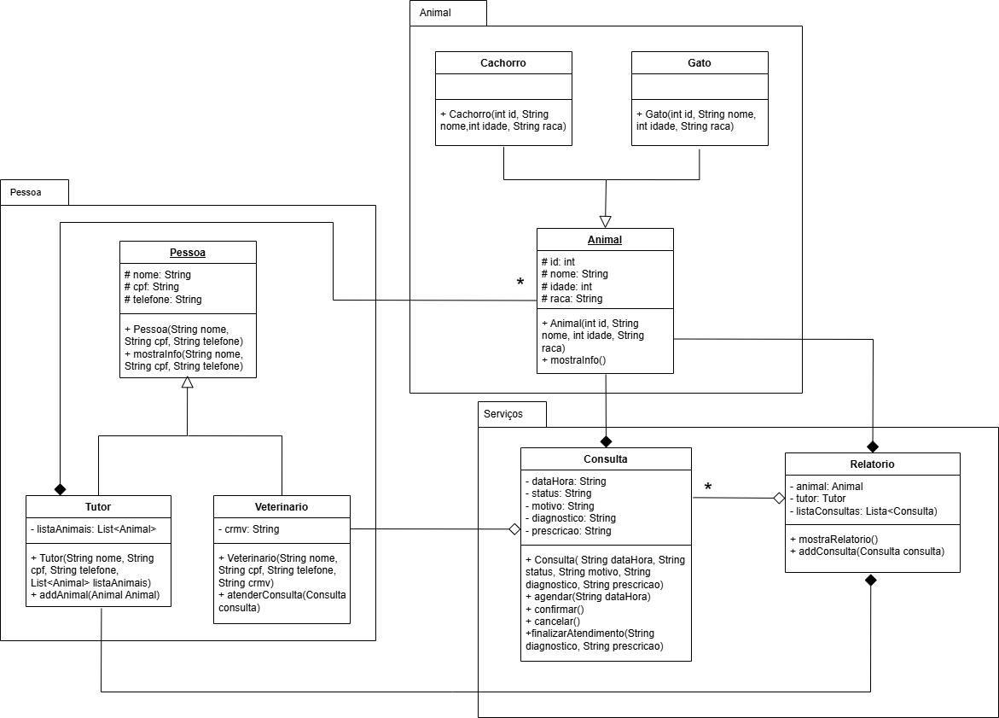

# 🐾 VetCare: Sistema de Gerenciamento de Clínica Veterinária

## 📝 Visão Geral do Projeto

Este projeto, denominado **VetCare**, é um sistema de gerenciamento de clínica veterinária desenvolvido em **Java** para a disciplina de **C06 - Programação Orientada a Objetos (POO)**. O objetivo é aplicar os princípios de POO na simulação das operações essenciais de uma clínica.

### 👥 Membros do Grupo
* **Giovana Franciele Gonçalves Leite**
* **Maria Victoria da Costa**

---

## 📐 Arquitetura do Sistema (Diagrama UML)

O sistema foi estruturado com base no seguinte diagrama de classes UML:

